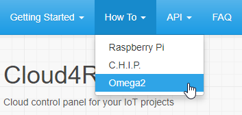

# Cloud4RPi Documentation

This website provides documentation for the [Cloud4RPi](https://cloud4rpi.io/) service&mdash;a cloud control panel for your IoT projects.

---

## Supported Platforms

Cloud4RPi can communicates with almost any device via the [MQTT](https://en.wikipedia.org/wiki/MQTT) or **HTTP** protocol. 

Currently we provide detailed instructions and examples for the following platforms and languages:

- [Raspberry Pi](https://www.raspberrypi.org/products/) on [Python](https://www.python.org/)
- [Next Thing Co. C.H.I.P.](https://getchip.com/pages/chip) on [Python](https://www.python.org/)
- [Onion Omega2](https://onion.io/omega2/) on [Python](https://www.python.org/)
- [ESP8266](https://en.wikipedia.org/wiki/ESP8266/) on [MicroPython](https://micropython.org/)
- [ESP8266](https://en.wikipedia.org/wiki/ESP8266/) on [PlatformIO](http://platformio.org)
- [ESP8266](https://en.wikipedia.org/wiki/ESP8266/) on [Arduino](https://www.arduino.cc/)

!!! Note
    Both Python 2 and Python 3 are supported.

[Contact us](https://cloud4rpi.answerdesk.io/) if your device or preferred language is not listed, we are here to help.

## Documentation Structure

The **Getting Started** and **How To** sections are different for each platform. Use the drop-down menu on these sections to select your platform:

## Where to Begin?

If you are new to Cloud4RPi, start with the **Getting Started** topic for your platform:

- [Connecting a Raspberry Pi Board](/start/rpi/)
- [Connecting a C.H.I.P. Board](/start/chip/)
- [Connecting an Omega2 Board](/start/o2/)
- [Connecting an ESP8266 Board using MicroPython](/start/esp8266-upy/)
- [Connecting an ESP8266 Board using PlatformIO](/start/esp-pio/)
- [Connecting an ESP8266 Board using Arduino](/start/esp-ino/)
