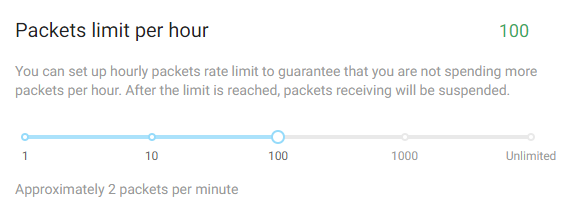

# Manage Packets

## The Free Tier

Starting from the date of your registration, you receive 10k free packets every new month. This amount is sufficient to send data to the cloud every five minutes for the whole month.

## Purchase Additional Packets

If you need a higher throughput, you can purchase additional packets. For prices, refer to the pricing page.

## Packet Spending Rate

You are free to spend packets at any rate. The packets that you did not spend in the current month are carried over to the next month. This applies to both free and additional packets.

## Sending Data When Out of Packets

If you are out of packets in the current month, you can still send data at limited rate - 1 packet an hour.

## Control the Spending Rate

You can specify a personal spending cap to ensure that you never spend too many packets in rapid succession. To achieve this, go to your account settings page and locate the **Pricing Plan** category. Use the **Packets limit per hour** slider to specify the spending cap.

The minimum cap is 1 packet an hour, the maximum is unlimited.

## General Recommendations

Make sure to set up the spending cap based on your budget and your project's requirements.
